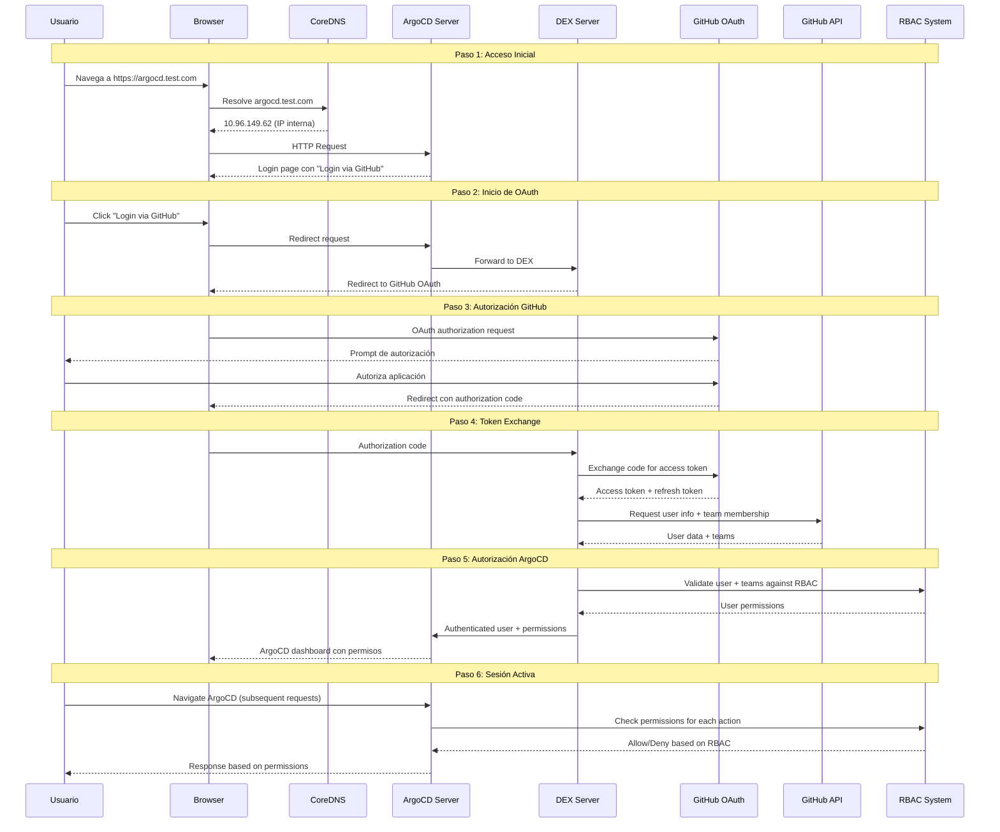

# 🏗️ ArgoCD GitHub Authentication - Diagramas de Arquitectura

**Fecha**: 20 de Septiembre, 2025
**Versión**: 1.0
**Estado**: Implementación Exitosa

---

## 📋 Índice de Diagramas

1. [Arquitectura General](#arquitectura-general)
2. [Flujo de Autenticación](#flujo-de-autenticación)
3. [Topología de Red](#topología-de-red)
4. [Componentes del Sistema](#componentes-del-sistema)
5. [Flujo de Datos](#flujo-de-datos)
6. [Estructura de Configuración](#estructura-de-configuración)

---

## 🌐 Arquitectura General

### Vista de Alto Nivel
```
┌─────────────────────────────────────────────────────────────────────────────┐
│                          EXTERNAL ACCESS LAYER                             │
├─────────────────────────────────────────────────────────────────────────────┤
│                                                                             │
│  ┌─────────────┐     ┌─────────────┐     ┌─────────────┐                   │
│  │   Browser   │────▶│ GitHub.com  │────▶│argocd.test. │                   │
│  │   (User)    │     │   OAuth     │     │    com      │                   │
│  └─────────────┘     └─────────────┘     └─────────────┘                   │
│                                                  │                          │
└──────────────────────────────────────────────────┼──────────────────────────┘
                                                   │
┌──────────────────────────────────────────────────┼──────────────────────────┐
│                          DNS RESOLUTION LAYER                              │
├──────────────────────────────────────────────────┼──────────────────────────┤
│                                                  │                          │
│  ┌─────────────┐              ┌─────────────┐    │                          │
│  │ External DNS│              │  CoreDNS    │    │                          │
│  │69.167.164.  │─────────────▶│   Hosts     │────┼─────────────────┐        │
│  │    199      │              │   Entry     │    │                 │        │
│  └─────────────┘              └─────────────┘    │                 │        │
│                                      │           │                 │        │
└──────────────────────────────────────┼───────────┼─────────────────┼────────┘
                                       │           │                 │
┌──────────────────────────────────────┼───────────┼─────────────────┼────────┐
│                       KUBERNETES CLUSTER LAYER                     │        │
├──────────────────────────────────────┼───────────┼─────────────────┼────────┤
│                                      │           │                 │        │
│  ┌─────────────┐              ┌─────────────┐    │    ┌─────────────┴─────┐  │
│  │  ArgoCD     │◀─────────────│   ArgoCD    │◀───┘    │      ArgoCD       │  │
│  │    DEX      │              │   Server    │         │       RBAC        │  │
│  │  (GitHub    │              │   (Main     │         │   (Permissions)   │  │
│  │ Connector)  │              │    UI)      │         │                   │  │
│  └─────────────┘              └─────────────┘         └───────────────────┘  │
│       │                              │                                      │
│       │                              │                                      │
│  ┌─────────────┐              ┌─────────────┐                               │
│  │   GitHub    │              │   ArgoCD    │                               │
│  │ OAuth App   │              │   Secret    │                               │
│  │(Credentials)│              │ Management  │                               │
│  └─────────────┘              └─────────────┘                               │
│                                                                             │
└─────────────────────────────────────────────────────────────────────────────┘
```

### Componentes Principales
```
┌────────────────┬─────────────────┬──────────────────┬────────────────────┐
│   Component    │      Type       │    Function      │    Dependencies    │
├────────────────┼─────────────────┼──────────────────┼────────────────────┤
│ GitHub OAuth   │ External API    │ User Auth        │ Internet Access    │
│ ArgoCD Server  │ K8s Deployment  │ Main UI/API      │ DEX, RBAC          │
│ ArgoCD DEX     │ K8s Deployment  │ Identity Broker  │ GitHub OAuth       │
│ CoreDNS        │ K8s Deployment  │ DNS Resolution   │ Cluster Network    │
│ RBAC ConfigMap │ K8s Resource    │ Authorization    │ GitHub Teams       │
│ Secrets        │ K8s Resource    │ Credentials      │ Manual Config      │
└────────────────┴─────────────────┴──────────────────┴────────────────────┘
```

---

## 🔄 Flujo de Autenticación

### Secuencia Completa de Login


### Estados del Usuario
```
┌─────────────────┐    ┌─────────────────┐    ┌─────────────────┐
│   Anonymous     │───▶│  Authenticating │───▶│  Authenticated  │
│                 │    │                 │    │                 │
│ - No session    │    │ - OAuth flow    │    │ - Valid session │
│ - Login button  │    │ - GitHub auth   │    │ - Role assigned │
│ - Public access │    │ - Token exchange│    │ - Full access   │
└─────────────────┘    └─────────────────┘    └─────────────────┘
         ▲                       │                       │
         │                       ▼                       │
         │              ┌─────────────────┐              │
         └──────────────│  Auth Failed    │◀─────────────┘
                        │                 │
                        │ - Invalid creds │
                        │ - Access denied │
                        │ - Session expired│
                        └─────────────────┘
```

---

## 🌐 Topología de Red

### Flujo de Red Externo vs Interno
```
EXTERNAL NETWORK FLOW:
┌─────────────┐    ┌─────────────┐    ┌─────────────────┐
│   Internet  │───▶│  Router/    │───▶│  Kubernetes     │
│   Browser   │    │  Firewall   │    │  Ingress/LB     │
└─────────────┘    └─────────────┘    └─────────────────┘
       │                                        │
       │ DNS: argocd.test.com                   │
       │ IP: 69.167.164.199                     │
       └────────────────────────────────────────┘

INTERNAL NETWORK FLOW:
┌─────────────────────────────────────────────────────────────────┐
│                    KUBERNETES CLUSTER                          │
│                                                                 │
│  ┌─────────────┐    ┌─────────────┐    ┌─────────────┐        │
│  │   CoreDNS   │───▶│  ArgoCD     │───▶│    DEX      │        │
│  │   Service   │    │  Service    │    │  Service    │        │
│  │ 10.96.0.10  │    │10.96.149.62 │    │10.96.232.145│        │
│  └─────────────┘    └─────────────┘    └─────────────┘        │
│                                                                 │
│  DNS Resolution:                                               │
│  argocd.test.com → 10.96.149.62 (internal)                   │
│                                                                 │
└─────────────────────────────────────────────────────────────────┘
```

### Puertos y Protocolos
```
┌─────────────────┬──────────┬──────────┬─────────────────────────┐
│    Service      │   Port   │ Protocol │       Purpose           │
├─────────────────┼──────────┼──────────┼─────────────────────────┤
│ argocd-server   │   443    │  HTTPS   │ Main UI/API             │
│ argocd-server   │    80    │  HTTP    │ Redirect to HTTPS       │
│ argocd-dex-     │  5556    │  HTTPS   │ DEX OIDC endpoints      │
│ server          │  5557    │  gRPC    │ DEX internal API        │
│ coredns         │    53    │  DNS     │ DNS resolution          │
│ GitHub OAuth    │   443    │  HTTPS   │ External OAuth API      │
│ GitHub API      │   443    │  HTTPS   │ User/Team info          │
└─────────────────┴──────────┴──────────┴─────────────────────────┘
```

### Rutas de Tráfico
```
USER AUTHENTICATION TRAFFIC:
Browser → argocd.test.com:443 → ArgoCD Server Pod
                                       ↓
ArgoCD Server → DEX Service:5556 → DEX Server Pod
                                       ↓
DEX Server → github.com:443 → GitHub OAuth API

INTERNAL SERVICE DISCOVERY:
ArgoCD Server Pod → CoreDNS:53 → DNS Resolution
                                       ↓
DNS Response: argocd.test.com = 10.96.149.62

RBAC VALIDATION:
ArgoCD Server → RBAC ConfigMap → Policy Engine
                     ↓
Policy Decision → Allow/Deny User Action
```

---

## 🧩 Componentes del Sistema

### Estructura de Pods y Servicios
```
NAMESPACE: argocd
├── DEPLOYMENTS
│   ├── argocd-server
│   │   ├── Replicas: 1
│   │   ├── Image: quay.io/argoproj/argocd:v3.1.5
│   │   ├── Ports: 8080 (HTTPS), 8083 (Metrics)
│   │   └── Mounts: argocd-cm, argocd-secret, argocd-rbac-cm
│   │
│   ├── argocd-dex-server
│   │   ├── Replicas: 1
│   │   ├── Image: ghcr.io/dexidp/dex:v2.37.0
│   │   ├── Ports: 5556 (HTTPS), 5557 (gRPC), 5558 (Metrics)
│   │   └── Mounts: argocd-dex-server-oauth-app
│   │
│   └── argocd-repo-server
│       ├── Replicas: 1
│       ├── Image: quay.io/argoproj/argocd:v3.1.5
│       └── Purpose: Git repository management
│
├── SERVICES
│   ├── argocd-server (ClusterIP: 10.96.149.62)
│   ├── argocd-dex-server (ClusterIP: 10.96.232.145)
│   └── argocd-repo-server (ClusterIP: 10.96.63.73)
│
├── CONFIGMAPS
│   ├── argocd-cm (Main configuration + DEX config)
│   ├── argocd-rbac-cm (RBAC policies)
│   └── argocd-cmd-params-cm (Command parameters)
│
└── SECRETS
    ├── argocd-secret (GitHub credentials + server secrets)
    ├── argocd-initial-admin-secret (Emergency access)
    └── argocd-server-tls (TLS certificates)

NAMESPACE: kube-system
└── DEPLOYMENTS
    └── coredns
        ├── Replicas: 2
        ├── Image: registry.k8s.io/coredns/coredns:v1.10.1
        └── ConfigMap: coredns (DNS configuration + hosts)
```

### Flujo de Configuración
```
┌─────────────────┐
│   GitHub OAuth  │
│      App        │
│  (External)     │
└─────────┬───────┘
          │
          ▼
┌─────────────────┐    ┌─────────────────┐    ┌─────────────────┐
│  argocd-secret  │───▶│   argocd-cm     │───▶│ argocd-rbac-cm  │
│                 │    │                 │    │                 │
│ - clientId      │    │ - dex.config    │    │ - policy.csv    │
│ - clientSecret  │    │ - url           │    │ - policy.default│
│ - server.secret │    │ - admin.enabled │    │ - policy.match  │
└─────────────────┘    └─────────────────┘    └─────────────────┘
          │                       │                       │
          └───────────────────────┼───────────────────────┘
                                  ▼
                    ┌─────────────────┐
                    │ ArgoCD Server   │
                    │   Runtime       │
                    │ Configuration   │
                    └─────────────────┘
```

---

## 📊 Flujo de Datos

### Datos de Autenticación
```
GITHUB USER DATA FLOW:
┌─────────────────┐    ┌─────────────────┐    ┌─────────────────┐
│   GitHub API    │───▶│  DEX Server     │───▶│ ArgoCD Server   │
│                 │    │                 │    │                 │
│ User Profile:   │    │ Token Exchange: │    │ Session Data:   │
│ - username      │    │ - access_token  │    │ - user_id       │
│ - email         │    │ - refresh_token │    │ - groups        │
│ - teams[]       │    │ - expires_in    │    │ - permissions   │
│ - org_member    │    │ - scope         │    │ - session_ttl   │
└─────────────────┘    └─────────────────┘    └─────────────────┘
```

### Datos de Autorización
```
RBAC DECISION FLOW:
┌─────────────────┐    ┌─────────────────┐    ┌─────────────────┐
│ User Request    │───▶│ RBAC Engine     │───▶│ Access Decision │
│                 │    │                 │    │                 │
│ - user_id       │    │ Policy Rules:   │    │ Response:       │
│ - action        │    │ - role mapping  │    │ - allow/deny    │
│ - resource      │    │ - permissions   │    │ - reason        │
│ - namespace     │    │ - constraints   │    │ - alternatives  │
└─────────────────┘    └─────────────────┘    └─────────────────┘
```

### Estructura de Datos de Configuración
```yaml
# argocd-cm ConfigMap
dex.config: |
  connectors:
  - type: github
    id: github
    name: GitHub
    config:
      clientID: $dex.github.clientId      # → argocd-secret
      clientSecret: $dex.github.clientSecret # → argocd-secret
      orgs:
      - name: Portfolio-jaime             # GitHub Organization
      teamNameField: slug                 # Team identifier format
      useLoginAsID: false                 # Use GitHub username

# argocd-rbac-cm ConfigMap
policy.csv: |
  # Role definitions
  p, role:admin, applications, *, */*, allow
  p, role:developer, applications, get, */*, allow

  # Group mappings
  g, Portfolio-jaime:argocd-admins, role:admin    # GitHub team → ArgoCD role
  g, Portfolio-jaime:developers, role:developer   # GitHub team → ArgoCD role

# argocd-secret Secret
stringData:
  dex.github.clientId: "Ov23liEQt4VaCr0gZWvH"
  dex.github.clientSecret: "313208e7de3273228dfb87bb47e565030e853b4c"
  server.secretkey: "b8edb657579e8f218aea1e59e5ec319b7ccd6150d3af3f1a8bb3d743bc04eb9a"
```

---

## ⚙️ Estructura de Configuración

### Jerarquía de Configuración
```
┌─────────────────────────────────────────────────────────────────────────┐
│                        CONFIGURATION HIERARCHY                         │
├─────────────────────────────────────────────────────────────────────────┤
│                                                                         │
│  ┌─────────────────┐              ┌─────────────────┐                  │
│  │   GitHub OAuth  │              │  ArgoCD Core    │                  │
│  │      App        │─────────────▶│  Configuration  │                  │
│  │                 │              │                 │                  │
│  │ - Client ID     │              │ - Server URL    │                  │
│  │ - Client Secret │              │ - Admin Access  │                  │
│  │ - Callback URL  │              │ - TLS Settings  │                  │
│  └─────────────────┘              └─────────────────┘                  │
│            │                                │                           │
│            ▼                                ▼                           │
│  ┌─────────────────┐              ┌─────────────────┐                  │
│  │   DEX Identity  │              │   RBAC Access   │                  │
│  │   Provider      │◀─────────────│    Control      │                  │
│  │                 │              │                 │                  │
│  │ - GitHub Conn   │              │ - Policies      │                  │
│  │ - Org/Teams     │              │ - Role Mapping  │                  │
│  │ - User Claims   │              │ - Permissions   │                  │
│  └─────────────────┘              └─────────────────┘                  │
│            │                                │                           │
│            └────────────┬───────────────────┘                           │
│                         ▼                                               │
│                ┌─────────────────┐                                      │
│                │  Runtime Auth   │                                      │
│                │   & Authz       │                                      │
│                │                 │                                      │
│                │ - User Sessions │                                      │
│                │ - Access Checks │                                      │
│                │ - Audit Logs    │                                      │
│                └─────────────────┘                                      │
│                                                                         │
└─────────────────────────────────────────────────────────────────────────┘
```

### Dependencias de Configuración
```
┌────────────────────────────────────────────────────────────────────────┐
│                    CONFIGURATION DEPENDENCIES                         │
├────────────────────────────────────────────────────────────────────────┤
│                                                                        │
│  LEVEL 1: Infrastructure                                              │
│  ┌─────────────┐    ┌─────────────┐    ┌─────────────┐              │
│  │ Kubernetes  │    │   CoreDNS   │    │  Network    │              │
│  │   Cluster   │    │    Hosts    │    │   Access    │              │
│  └─────────────┘    └─────────────┘    └─────────────┘              │
│          │                   │                   │                   │
│          └───────────────────┼───────────────────┘                   │
│                              ▼                                       │
│  LEVEL 2: Platform Services                                          │
│  ┌─────────────┐    ┌─────────────┐    ┌─────────────┐              │
│  │   ArgoCD    │    │    DEX      │    │   GitHub    │              │
│  │  Services   │    │  Services   │    │OAuth Service│              │
│  └─────────────┘    └─────────────┘    └─────────────┘              │
│          │                   │                   │                   │
│          └───────────────────┼───────────────────┘                   │
│                              ▼                                       │
│  LEVEL 3: Configuration Data                                         │
│  ┌─────────────┐    ┌─────────────┐    ┌─────────────┐              │
│  │ ConfigMaps  │    │   Secrets   │    │   RBAC      │              │
│  │  (Settings) │    │(Credentials)│    │ (Policies)  │              │
│  └─────────────┘    └─────────────┘    └─────────────┘              │
│          │                   │                   │                   │
│          └───────────────────┼───────────────────┘                   │
│                              ▼                                       │
│  LEVEL 4: Runtime State                                              │
│  ┌─────────────┐    ┌─────────────┐    ┌─────────────┐              │
│  │ User        │    │  Session    │    │ Permission  │              │
│  │ Sessions    │    │   State     │    │   Cache     │              │
│  └─────────────┘    └─────────────┘    └─────────────┘              │
│                                                                        │
└────────────────────────────────────────────────────────────────────────┘
```

### Template de Configuración
```yaml
# Configuration Template (variables to be replaced)
apiVersion: v1
kind: ConfigMap
metadata:
  name: argocd-cm
  namespace: argocd
data:
  url: ${ARGOCD_SERVER_URL}                    # https://argocd.test.com
  admin.enabled: "${ADMIN_ENABLED}"            # "true"
  exec.enabled: "${EXEC_ENABLED}"              # "false"

  dex.config: |
    connectors:
    - type: github
      id: github
      name: GitHub
      config:
        clientID: $dex.github.clientId
        clientSecret: $dex.github.clientSecret
        orgs:
        - name: ${GITHUB_ORG}                  # Portfolio-jaime
        teamNameField: slug
        useLoginAsID: false

---
apiVersion: v1
kind: Secret
metadata:
  name: argocd-secret
  namespace: argocd
type: Opaque
stringData:
  dex.github.clientId: "${GITHUB_CLIENT_ID}"
  dex.github.clientSecret: "${GITHUB_CLIENT_SECRET}"
  server.secretkey: "${SERVER_SECRET_KEY}"

---
apiVersion: v1
kind: ConfigMap
metadata:
  name: argocd-rbac-cm
  namespace: argocd
data:
  policy.default: role:readonly
  policy.csv: |
    # Admin permissions
    p, role:admin, applications, *, */*, allow
    p, role:admin, clusters, *, *, allow
    p, role:admin, repositories, *, *, allow
    p, role:admin, certificates, *, *, allow
    p, role:admin, accounts, *, *, allow
    p, role:admin, gpgkeys, *, *, allow

    # Developer permissions
    p, role:developer, applications, get, */*, allow
    p, role:developer, applications, sync, */*, allow
    p, role:developer, repositories, get, *, allow
    p, role:developer, clusters, get, *, allow

    # GitHub team mappings
    g, ${GITHUB_ORG}:${ADMIN_TEAM}, role:admin
    g, ${GITHUB_ORG}:${DEVELOPER_TEAM}, role:developer

  policy.matchMode: glob
```

---

## 📈 Monitoring y Observabilidad

### Puntos de Monitoreo
```
COMPONENT HEALTH MONITORING:
┌─────────────────┬─────────────────┬─────────────────┬─────────────────┐
│   Component     │    Endpoint     │     Metric      │   Alert Level   │
├─────────────────┼─────────────────┼─────────────────┼─────────────────┤
│ ArgoCD Server   │ /healthz        │ HTTP 200        │ Critical        │
│ DEX Server      │ /healthz        │ HTTP 200        │ Critical        │
│ CoreDNS         │ /health         │ HTTP 200        │ Warning         │
│ GitHub OAuth    │ API Rate Limits │ < 80% usage     │ Warning         │
└─────────────────┴─────────────────┴─────────────────┴─────────────────┘

AUTHENTICATION FLOW MONITORING:
┌─────────────────┬─────────────────┬─────────────────┬─────────────────┐
│    Metric       │   Collection    │    Threshold    │    Action       │
├─────────────────┼─────────────────┼─────────────────┼─────────────────┤
│ Login Success   │ Application Logs│ > 95%           │ Monitor         │
│ Login Failures  │ Application Logs│ < 5%            │ Alert if >10%   │
│ Session Duration│ Session Store   │ Normal: 8h      │ Monitor trends  │
│ OAuth Latency   │ Network Metrics │ < 2s            │ Alert if >5s    │
└─────────────────┴─────────────────┴─────────────────┴─────────────────┘
```

### Dashboards Recomendados
```
OPERATIONAL DASHBOARD:
├── System Health
│   ├── Pod Status (Running/Failed/Pending)
│   ├── Resource Usage (CPU/Memory)
│   └── Network Connectivity
├── Authentication Metrics
│   ├── Login Success Rate
│   ├── Active Sessions
│   └── OAuth Response Times
└── Security Metrics
    ├── Failed Login Attempts
    ├── Privilege Escalation Attempts
    └── Unusual Access Patterns

TROUBLESHOOTING DASHBOARD:
├── Error Logs
│   ├── ArgoCD Server Errors
│   ├── DEX Server Errors
│   └── CoreDNS Resolution Failures
├── Network Debugging
│   ├── DNS Resolution Times
│   ├── Service Discovery Issues
│   └── TLS Certificate Status
└── Configuration Validation
    ├── RBAC Policy Violations
    ├── GitHub API Rate Limits
    └── Token Expiration Warnings
```

---

**📐 Esta documentación de arquitectura proporciona una vista completa del sistema implementado, incluyendo todos los componentes, flujos de datos y dependencias.**

**Autor**: Jaime Henao
**Fecha**: 20 de Septiembre, 2025
**Estado**: Documentación Completa - Arquitectura Funcional