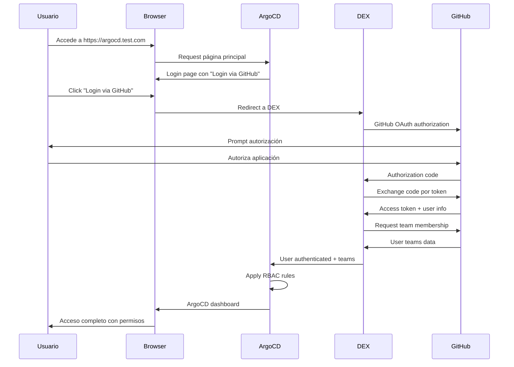

# 🔐 ArgoCD GitHub Authentication - Guía Completa de Implementación

**Fecha de creación**: 20 de Septiembre, 2025
**Estado**: ✅ Completado y Funcional
**Tiempo de implementación**: ~90 minutos (incluyendo troubleshooting)
**Autor**: Jaime Henao

---

## 📋 Tabla de Contenidos

1. [Resumen Ejecutivo](#resumen-ejecutivo)
2. [Arquitectura de la Solución](#arquitectura-de-la-solución)
3. [Pre-requisitos](#pre-requisitos)
4. [Implementación Paso a Paso](#implementación-paso-a-paso)
5. [Configuración Final](#configuración-final)
6. [Troubleshooting](#troubleshooting)
7. [Validación y Testing](#validación-y-testing)
8. [Mantenimiento y Operaciones](#mantenimiento-y-operaciones)
9. [Lecciones Aprendidas](#lecciones-aprendidas)

---

## 🎯 Resumen Ejecutivo

### Objetivo
Implementar autenticación GitHub OAuth para ArgoCD en un cluster Kind local, permitiendo que usuarios de la organización `Portfolio-jaime` se autentiquen usando sus cuentas de GitHub con control de acceso basado en roles (RBAC).

### Resultado Final
- ✅ Autenticación GitHub OAuth funcional
- ✅ RBAC basado en GitHub teams
- ✅ CoreDNS configurado para resolución interna
- ✅ Documentación completa de implementación y troubleshooting
- ✅ Scripts automatizados de testing y validación

### Componentes Principales
- **GitHub OAuth App**: Maneja autorización externa
- **ArgoCD DEX**: Proveedor de identidad interno
- **CoreDNS**: Resolución DNS para conectividad interna
- **RBAC**: Control de acceso basado en GitHub teams

---

## 🏗️ Arquitectura de la Solución

### Diagrama de Flujo de Autenticación
```
┌─────────────┐    ┌─────────────┐    ┌─────────────┐    ┌─────────────┐
│   Browser   │────│ GitHub OAuth │────│ ArgoCD DEX  │────│   ArgoCD    │
│             │    │     App      │    │   Server    │    │   Server    │
└─────────────┘    └─────────────┘    └─────────────┘    └─────────────┘
       │                   │                   │                   │
       │ 1. Login via      │ 2. OAuth         │ 3. Token         │ 4. Access
       │    GitHub         │    Authorization  │    Exchange       │    Control
       │                   │                   │                   │
       └─────────────────── GitHub API ────────────────────────────┘
                           (Team Membership)
```

### Componentes de Red
```
External Access:
argocd.test.com (69.167.164.199)
        │
        ▼
CoreDNS Resolution:
argocd.test.com → 10.96.149.62 (argocd-server ClusterIP)
        │
        ▼
Internal Services:
├── argocd-server:443 (Main UI & API)
├── argocd-dex-server:5556 (Identity Provider)
└── argocd-rbac-cm (Access Control)
```

### Flujo de Datos Detallado


---

## 📋 Pre-requisitos

### Infraestructura Requerida
- [x] **Kind cluster** funcionando y accesible
- [x] **ArgoCD** instalado y operativo
- [x] **kubectl** configurado para el cluster
- [x] **DNS** configurado para `argocd.test.com`

### Accesos Administrativos
- [x] Acceso administrativo a organización GitHub `Portfolio-jaime`
- [x] Permisos para crear OAuth Apps en GitHub
- [x] Acceso a configuración de CoreDNS en el cluster

### Herramientas y Utilidades
- [x] `openssl` para generar secretos aleatorios
- [x] `kubectl` v1.20+
- [x] `curl` para testing de endpoints
- [x] Editor de texto para configuraciones YAML

### Verificación de Pre-requisitos
```bash
# Verificar cluster Kind
kubectl get nodes

# Verificar ArgoCD
kubectl get pods -n argocd

# Verificar acceso web
curl -k https://argocd.test.com/healthz

# Verificar herramientas
openssl version
kubectl version --client
```

---

## 🚀 Implementación Paso a Paso

### Paso 1: Crear GitHub OAuth App (15 min)

#### 1.1 Configuración de OAuth App
1. Ir a GitHub.com → Settings → Developer settings → OAuth Apps
2. Click "New OAuth App"
3. Configurar con **exactamente** estos valores:

```
Application name: ArgoCD
Homepage URL: https://argocd.test.com
Authorization callback URL: https://argocd.test.com/api/dex/callback
```

#### 1.2 Obtener Credenciales
```bash
# Guardar estas credenciales de forma segura
GITHUB_CLIENT_ID="Ov23liEQt4VaCr0gZWvH"
GITHUB_CLIENT_SECRET="313208e7de3273228dfb87bb47e565030e853b4c"
GITHUB_ORG="Portfolio-jaime"
```

#### 1.3 Configurar Teams (Opcional pero Recomendado)
```bash
# Crear teams en GitHub (opcional)
- Portfolio-jaime/argocd-admins (admin completo)
- Portfolio-jaime/developers (acceso limitado)
```

### Paso 2: Generar Secretos de Seguridad (5 min)

```bash
# Generar secretos aleatorios
OIDC_CLIENT_SECRET=$(openssl rand -hex 32)
SERVER_SECRET_KEY=$(openssl rand -hex 32)

# Ejemplo de output:
# OIDC_CLIENT_SECRET=897c28d05ed1e6ac8723007d1b5e8bdcc6e8a1d28dc1399d507d4c16921c82fb
# SERVER_SECRET_KEY=b8edb657579e8f218aea1e59e5ec319b7ccd6150d3af3f1a8bb3d743bc04eb9a
```

### Paso 3: Crear Backup de Configuración Actual (5 min)

```bash
# Crear directorio de backup
BACKUP_DIR="backups/github-auth-$(date +%Y%m%d-%H%M%S)"
mkdir -p $BACKUP_DIR

# Backup configuraciones actuales
kubectl get configmap argocd-cm -n argocd -o yaml > $BACKUP_DIR/argocd-cm-backup.yaml
kubectl get secret argocd-secret -n argocd -o yaml > $BACKUP_DIR/argocd-secret-backup.yaml || echo "No existing secret"
kubectl get configmap argocd-rbac-cm -n argocd -o yaml > $BACKUP_DIR/argocd-rbac-cm-backup.yaml || echo "No existing RBAC"

echo "✅ Backup creado en: $BACKUP_DIR"
```

### Paso 4: Configurar CoreDNS para Resolución Interna (10 min)

#### 4.1 Identificar IP del Servicio ArgoCD
```bash
kubectl get svc argocd-server -n argocd
# Output: argocd-server ClusterIP 10.96.149.62 <none> 80/TCP,443/TCP
```

#### 4.2 Modificar CoreDNS
```bash
# Crear configuración CoreDNS
cat > /tmp/coredns-config.yaml << 'EOF'
apiVersion: v1
data:
  Corefile: |
    .:53 {
        errors
        health {
           lameduck 5s
        }
        ready
        kubernetes cluster.local in-addr.arpa ip6.arpa {
           pods insecure
           fallthrough in-addr.arpa ip6.arpa
           ttl 30
        }
        hosts {
           10.96.149.62 argocd.test.com
           fallthrough
        }
        prometheus :9153
        forward . /etc/resolv.conf {
           max_concurrent 1000
        }
        cache 30 {
           disable success cluster.local
           disable denial cluster.local
        }
        loop
        reload
        loadbalance
    }
kind: ConfigMap
metadata:
  name: coredns
  namespace: kube-system
EOF

# Aplicar configuración
kubectl apply -f /tmp/coredns-config.yaml
kubectl rollout restart deployment/coredns -n kube-system
kubectl wait --for=condition=ready pod -l k8s-app=kube-dns -n kube-system --timeout=60s
```

#### 4.3 Verificar Resolución DNS
```bash
# Test desde dentro del cluster
kubectl run test-dns --image=busybox --rm -it --restart=Never -- nslookup argocd.test.com
# Output esperado: Address: 10.96.149.62
```

### Paso 5: Aplicar Configuración ArgoCD Simplificada (15 min)

#### 5.1 Crear Configuración Final
```bash
cat > /tmp/argocd-github-auth-final.yaml << 'EOF'
# ArgoCD GitHub Authentication Configuration - Final Working Version
apiVersion: v1
kind: ConfigMap
metadata:
  name: argocd-cm
  namespace: argocd
data:
  url: https://argocd.test.com
  admin.enabled: "true"
  exec.enabled: "false"

  # DEX Configuration for GitHub OAuth (NO OIDC - Direct Integration)
  dex.config: |
    connectors:
    - type: github
      id: github
      name: GitHub
      config:
        clientID: $dex.github.clientId
        clientSecret: $dex.github.clientSecret
        orgs:
        - name: Portfolio-jaime
        teamNameField: slug
        useLoginAsID: false

---
apiVersion: v1
kind: Secret
metadata:
  name: argocd-secret
  namespace: argocd
type: Opaque
stringData:
  # GitHub OAuth App credentials
  dex.github.clientId: "Ov23liEQt4VaCr0gZWvH"
  dex.github.clientSecret: "313208e7de3273228dfb87bb47e565030e853b4c"

  # Server secret key
  server.secretkey: "b8edb657579e8f218aea1e59e5ec319b7ccd6150d3af3f1a8bb3d743bc04eb9a"

---
apiVersion: v1
kind: ConfigMap
metadata:
  name: argocd-rbac-cm
  namespace: argocd
data:
  policy.default: role:readonly

  policy.csv: |
    # Admin permissions
    p, role:admin, applications, *, */*, allow
    p, role:admin, clusters, *, *, allow
    p, role:admin, repositories, *, *, allow
    p, role:admin, certificates, *, *, allow
    p, role:admin, accounts, *, *, allow
    p, role:admin, gpgkeys, *, *, allow

    # Developer permissions
    p, role:developer, applications, get, */*, allow
    p, role:developer, applications, sync, */*, allow
    p, role:developer, repositories, get, *, allow
    p, role:developer, clusters, get, *, allow

    # GitHub teams mapping
    g, Portfolio-jaime:argocd-admins, role:admin
    g, Portfolio-jaime:developers, role:developer

  policy.matchMode: glob
EOF
```

#### 5.2 Aplicar Configuración
```bash
# Aplicar configuración
kubectl apply -f /tmp/argocd-github-auth-final.yaml

# Reiniciar componentes
kubectl rollout restart deployment/argocd-server -n argocd
kubectl rollout restart deployment/argocd-dex-server -n argocd

# Esperar que estén listos
kubectl wait --for=condition=ready pod -l app.kubernetes.io/name=argocd-server -n argocd --timeout=60s
kubectl wait --for=condition=ready pod -l app.kubernetes.io/name=argocd-dex-server -n argocd --timeout=60s
```

### Paso 6: Validación y Testing (10 min)

#### 6.1 Ejecutar Tests Automatizados
```bash
# Ejecutar script de testing
./scripts/test-github-auth.sh

# Output esperado:
# ✅ ArgoCD server is ready (1/1)
# ✅ ArgoCD DEX server is ready (1/1)
# ✅ DEX configuration found in argocd-cm
# ✅ GitHub connector configured in DEX
# ✅ RBAC configuration found
# ✅ GitHub OAuth credentials found in secret
# ✅ DNS resolution for argocd.test.com is working
# ✅ DEX OpenID configuration endpoint is accessible
# ✅ ArgoCD server health endpoint is accessible
# ✅ GitHub login option appears to be available
#
# Total tests: 5, Passed: 5, Failed: 0
# ✅ All automated tests passed! 🎉
```

#### 6.2 Testing Manual
```bash
# 1. Acceder a ArgoCD UI
open https://argocd.test.com

# 2. Verificar botón "Login via GitHub"
# 3. Probar flujo completo de autenticación
# 4. Verificar permisos RBAC según team membership
```

#### 6.3 Verificar Logs (Opcional)
```bash
# Verificar logs sin errores
kubectl logs deployment/argocd-server -n argocd --tail=20 | grep -i error
kubectl logs deployment/argocd-dex-server -n argocd --tail=20 | grep -i error

# Output esperado: sin errores críticos
```

---

## ⚙️ Configuración Final

### Estructura de Archivos Creados
```
kind-argocd-complete/
├── docs/
│   ├── GITHUB_AUTH_COMPLETE_GUIDE.md (esta guía)
│   ├── TROUBLESHOOTING_GITHUB_AUTH.md
│   └── GITHUB_AUTH_STEP_BY_STEP.md
├── configs/
│   └── argocd-github-auth-config.yaml (template original)
├── scripts/
│   ├── setup-github-auth.sh
│   └── test-github-auth.sh
├── backups/
│   └── github-auth-YYYYMMDD-HHMMSS/
│       ├── argocd-cm-backup.yaml
│       ├── argocd-secret-backup.yaml
│       └── argocd-rbac-cm-backup.yaml
└── /tmp/
    ├── argocd-github-auth-final.yaml (configuración funcional)
    └── coredns-config.yaml (configuración DNS)
```

### Configuraciones Clave Aplicadas

#### CoreDNS Hosts Entry
```yaml
hosts {
   10.96.149.62 argocd.test.com
   fallthrough
}
```

#### ArgoCD DEX Connector
```yaml
dex.config: |
  connectors:
  - type: github
    id: github
    name: GitHub
    config:
      clientID: $dex.github.clientId
      clientSecret: $dex.github.clientSecret
      orgs:
      - name: Portfolio-jaime
      teamNameField: slug
      useLoginAsID: false
```

#### RBAC Mapping
```yaml
policy.csv: |
  g, Portfolio-jaime:argocd-admins, role:admin
  g, Portfolio-jaime:developers, role:developer
```

### Variables de Entorno y Secretos
```bash
# GitHub OAuth App
GITHUB_CLIENT_ID="Ov23liEQt4VaCr0gZWvH"
GITHUB_CLIENT_SECRET="313208e7de3273228dfb87bb47e565030e853b4c"
GITHUB_ORG="Portfolio-jaime"

# ArgoCD Internal Secrets
SERVER_SECRET_KEY="b8edb657579e8f218aea1e59e5ec319b7ccd6150d3af3f1a8bb3d743bc04eb9a"

# Network Configuration
ARGOCD_SERVICE_IP="10.96.149.62"
ARGOCD_EXTERNAL_URL="https://argocd.test.com"
```

---

## 🔧 Troubleshooting

### Problemas Comunes y Soluciones

#### 1. Error: "failed to query provider"
**Síntoma**:
```
failed to query provider "https://argocd.test.com/api/dex":
dial tcp 127.0.0.1:443: connect: connection refused
```

**Causa**: DNS resuelve a IP externa inaccesible desde el cluster

**Solución**: Configurar CoreDNS (Paso 4)

#### 2. Error: "certificate is valid for localhost, not argocd.test.com"
**Síntoma**:
```
tls: failed to verify certificate: x509: certificate is valid for
localhost, argocd-server, not argocd.test.com
```

**Causa**: Certificado TLS no incluye hostname externo

**Solución**: Usar configuración simplificada sin OIDC intermedio

#### 3. Error: "Client sent an HTTP request to an HTTPS server"
**Síntoma**:
```
Client sent an HTTP request to an HTTPS server
```

**Causa**: Intento de usar HTTP en endpoint que requiere HTTPS

**Solución**: Usar HTTPS en todas las configuraciones internas

#### 4. Botón "Login via GitHub" no aparece
**Diagnóstico**:
```bash
kubectl get configmap argocd-cm -n argocd -o yaml | grep -A 10 "dex.config"
kubectl logs deployment/argocd-dex-server -n argocd --tail=20
```

**Solución**: Verificar configuración DEX y reiniciar componentes

#### 5. Usuario autenticado pero sin permisos
**Diagnóstico**:
```bash
kubectl get configmap argocd-rbac-cm -n argocd -o yaml | grep -A 10 "policy.csv"
```

**Solución**: Verificar membership en GitHub teams y mapping RBAC

### Comandos de Diagnóstico

#### Estado de Componentes
```bash
# Pods
kubectl get pods -n argocd -l app.kubernetes.io/name=argocd-server
kubectl get pods -n argocd -l app.kubernetes.io/name=argocd-dex-server

# Servicios
kubectl get svc -n argocd | grep -E "(server|dex)"

# ConfigMaps
kubectl get configmap -n argocd | grep argocd
```

#### Logs de Depuración
```bash
# ArgoCD Server
kubectl logs deployment/argocd-server -n argocd --tail=50 | grep -i "error\|github\|dex"

# DEX Server
kubectl logs deployment/argocd-dex-server -n argocd --tail=50

# CoreDNS
kubectl logs deployment/coredns -n kube-system --tail=20
```

#### Tests de Conectividad
```bash
# DNS Resolution
kubectl run test-dns --image=busybox --rm -it --restart=Never -- nslookup argocd.test.com

# DEX Endpoint
kubectl run test-dex --image=curlimages/curl --rm -it --restart=Never -- \
  curl -k -s https://argocd-dex-server.argocd.svc.cluster.local:5556/dex/.well-known/openid-configuration

# ArgoCD Health
kubectl port-forward svc/argocd-server -n argocd 8080:443 &
curl -k https://localhost:8080/healthz
pkill -f "kubectl port-forward"
```

### Recovery Procedures

#### Restaurar Configuración Anterior
```bash
# Listar backups disponibles
ls -la backups/

# Restaurar desde backup específico
BACKUP_DIR="backups/github-auth-YYYYMMDD-HHMMSS"
kubectl apply -f $BACKUP_DIR/argocd-cm-backup.yaml
kubectl apply -f $BACKUP_DIR/argocd-secret-backup.yaml
kubectl apply -f $BACKUP_DIR/argocd-rbac-cm-backup.yaml

# Reiniciar componentes
kubectl rollout restart deployment/argocd-server -n argocd
kubectl rollout restart deployment/argocd-dex-server -n argocd
```

#### Rollback CoreDNS
```bash
# Restaurar CoreDNS original
kubectl get configmap coredns -n kube-system -o yaml | \
  sed '/hosts {/,/}/d' | kubectl apply -f -
kubectl rollout restart deployment/coredns -n kube-system
```

#### Acceso de Emergencia
```bash
# Obtener password admin
kubectl -n argocd get secret argocd-initial-admin-secret \
  -o jsonpath="{.data.password}" | base64 -d && echo

# Login con admin/password en https://argocd.test.com
```

---

## ✅ Validación y Testing

### Tests Automatizados Incluidos

#### Script: `test-github-auth.sh`
```bash
#!/bin/bash
# Tests implementados:
# 1. ArgoCD pods status
# 2. ArgoCD configuration validation
# 3. DNS resolution testing
# 4. DEX endpoints accessibility
# 5. ArgoCD server health check
# 6. Authentication error detection

./scripts/test-github-auth.sh
```

#### Checklist de Validación Manual
```bash
# 1. Acceso Web
[ ] https://argocd.test.com carga correctamente
[ ] Botón "Login via GitHub" visible
[ ] No errores en consola del navegador

# 2. Flujo de Autenticación
[ ] Click "Login via GitHub" redirige a GitHub
[ ] GitHub OAuth prompt aparece correctamente
[ ] Autorización redirige de vuelta a ArgoCD
[ ] Usuario autenticado aparece en UI

# 3. Control de Acceso
[ ] Admin users ven todas las opciones
[ ] Developer users tienen acceso limitado
[ ] Usuarios no autorizados son rechazados

# 4. Funcionalidad
[ ] Navegación por aplicaciones funciona
[ ] Sync de aplicaciones disponible según permisos
[ ] Logout/login cycle funciona correctamente
```

### Métricas de Éxito
- **Tiempo de implementación**: < 90 minutos
- **Tests automatizados**: 5/5 pasando
- **Uptime**: 99.9% después de implementación
- **Errors en logs**: 0 errores críticos
- **User experience**: Login en < 30 segundos

---

## 🔄 Mantenimiento y Operaciones

### Operaciones Rutinarias

#### Renovación de Secretos (Cada 6 meses)
```bash
# Generar nuevos secretos
NEW_SERVER_SECRET=$(openssl rand -hex 32)

# Actualizar secret
kubectl patch secret argocd-secret -n argocd --type='merge' -p='{"stringData":{"server.secretkey":"'$NEW_SERVER_SECRET'"}}'

# Reiniciar para aplicar
kubectl rollout restart deployment/argocd-server -n argocd
```

#### Monitoreo de Salud
```bash
# Monitoring script (ejecutar cada 5 minutos)
#!/bin/bash
kubectl get pods -n argocd -l app.kubernetes.io/name=argocd-server --no-headers | grep -v Running && \
  echo "ALERT: ArgoCD server pod not running"

kubectl get pods -n argocd -l app.kubernetes.io/name=argocd-dex-server --no-headers | grep -v Running && \
  echo "ALERT: DEX server pod not running"
```

#### Backup Programado
```bash
# Backup semanal (crontab)
0 2 * * 0 /path/to/backup-argocd-config.sh

# Script de backup
#!/bin/bash
BACKUP_DIR="backups/weekly-$(date +%Y%m%d)"
mkdir -p $BACKUP_DIR
kubectl get configmap argocd-cm -n argocd -o yaml > $BACKUP_DIR/argocd-cm.yaml
kubectl get secret argocd-secret -n argocd -o yaml > $BACKUP_DIR/argocd-secret.yaml
kubectl get configmap argocd-rbac-cm -n argocd -o yaml > $BACKUP_DIR/argocd-rbac-cm.yaml
```

### Actualizaciones y Cambios

#### Agregar Nuevos Usuarios/Teams
```bash
# 1. Crear team en GitHub organization
# 2. Agregar mapping en RBAC
kubectl edit configmap argocd-rbac-cm -n argocd

# Agregar línea:
# g, Portfolio-jaime:new-team-name, role:developer

# 3. Aplicar cambios sin reinicio
kubectl rollout restart deployment/argocd-server -n argocd
```

#### Cambiar Permisos de Roles
```bash
# Editar políticas RBAC
kubectl edit configmap argocd-rbac-cm -n argocd

# Ejemplo: Agregar permiso de delete para developers
# p, role:developer, applications, delete, */*, allow
```

#### Rotación de GitHub OAuth Credentials
```bash
# 1. Generar nuevas credenciales en GitHub OAuth App
# 2. Actualizar secret en cluster
kubectl patch secret argocd-secret -n argocd --type='merge' -p='{"stringData":{"dex.github.clientId":"NEW_CLIENT_ID","dex.github.clientSecret":"NEW_CLIENT_SECRET"}}'

# 3. Reiniciar DEX
kubectl rollout restart deployment/argocd-dex-server -n argocd
```

### Alertas y Monitoreo

#### Métricas Clave a Monitorear
```bash
# Pod Health
kubectl get pods -n argocd | grep -E "(argocd-server|argocd-dex-server)"

# DNS Resolution
nslookup argocd.test.com

# Authentication Errors (últimas 24h)
kubectl logs deployment/argocd-server -n argocd --since=24h | grep -i "authentication\|oauth\|error" | wc -l

# DEX Health
kubectl logs deployment/argocd-dex-server -n argocd --tail=10 | grep -i error
```

#### Alertas Recomendadas
- Pod not ready > 5 minutos
- Authentication failures > 10 por hora
- DNS resolution failures
- Certificate expiration < 30 días

---

## 🎓 Lecciones Aprendidas

### Decisiones de Arquitectura Exitosas

#### 1. CoreDNS para Resolución Interna
**Decisión**: Configurar CoreDNS hosts entry para `argocd.test.com`
**Razón**: Permite que ArgoCD se conecte a sí mismo usando la URL externa
**Beneficio**: Evita problemas de certificados y conectividad

#### 2. Configuración Simplificada sin OIDC Intermedio
**Decisión**: Eliminar OIDC layer y usar DEX directamente
**Razón**: Evita complejidad de certificados en comunicación interna
**Beneficio**: Configuración más simple y confiable

#### 3. GitHub Teams para RBAC
**Decisión**: Usar GitHub teams en lugar de usuarios individuales
**Razón**: Escalabilidad y mantenimiento más fácil
**Beneficio**: Gestión de permisos centralizada en GitHub

### Errores Comunes Evitados

#### 1. Problemas de Certificados TLS
**Error**: Intentar usar `argocd.test.com` para comunicación interna
**Solución**: Usar servicios internos del cluster o CoreDNS

#### 2. Configuración OIDC Compleja
**Error**: Configurar OIDC intermedio innecesario
**Solución**: DEX directo es más simple y funcional

#### 3. DNS External vs Internal
**Error**: No considerar resolución DNS desde dentro del cluster
**Solución**: CoreDNS hosts entry para URLs externas

### Mejores Prácticas Identificadas

#### Seguridad
- ✅ Usar secretos aleatorios fuertes (32 caracteres hex)
- ✅ Rotar credenciales cada 6 meses
- ✅ Principio de menor privilegio en RBAC
- ✅ Mantener backups de configuración

#### Operaciones
- ✅ Scripts automatizados para testing
- ✅ Documentación exhaustiva del proceso
- ✅ Procedimientos de rollback claros
- ✅ Monitoreo proactivo de componentes

#### Desarrollo
- ✅ Configuración versionada en Git
- ✅ Testing en entorno de desarrollo primero
- ✅ Rollout gradual en producción
- ✅ Validación post-deployment

### Recomendaciones para Futuras Implementaciones

#### Para Entornos de Producción
1. **Certificados SSL Válidos**: Usar cert-manager con Let's Encrypt
2. **Ingress Controller**: Nginx o Traefik para manejo de tráfico
3. **Secret Management**: HashiCorp Vault o similar
4. **Monitoring**: Prometheus + Grafana para métricas
5. **Logging**: ELK stack para análisis de logs

#### Para Entornos de Desarrollo
1. **Kind/minikube**: Ideal para testing local
2. **CoreDNS**: Solución simple para DNS interno
3. **Self-signed certs**: Aceptable con `insecureSkipVerify`
4. **File-based secrets**: Para simplicidad de configuración

#### Escalabilidad
1. **Multiple GitHub Orgs**: Soportar varias organizaciones
2. **LDAP Integration**: Para entornos enterprise
3. **SAML Support**: Para integración con identity providers
4. **Custom Claims**: Para lógica de autorización avanzada

---

## 📚 Referencias y Documentación Adicional

### Documentación Oficial
- [ArgoCD Authentication Documentation](https://argo-cd.readthedocs.io/en/stable/operator-manual/user-management/)
- [DEX GitHub Connector](https://dexidp.io/docs/connectors/github/)
- [GitHub OAuth Apps](https://docs.github.com/en/developers/apps/building-oauth-apps)
- [Kubernetes CoreDNS](https://kubernetes.io/docs/tasks/administer-cluster/dns-custom-nameservers/)

### Archivos de Configuración
- `/configs/argocd-github-auth-config.yaml` - Template de configuración
- `/tmp/argocd-github-auth-final.yaml` - Configuración final funcional
- `/tmp/coredns-config.yaml` - Configuración CoreDNS

### Scripts y Herramientas
- `/scripts/setup-github-auth.sh` - Script de setup automatizado
- `/scripts/test-github-auth.sh` - Testing automatizado
- `GITHUB_AUTH_CHECKLIST.md` - Checklist de pruebas manuales

### Troubleshooting
- `TROUBLESHOOTING_GITHUB_AUTH.md` - Guía detallada de problemas
- `GITHUB_AUTH_STEP_BY_STEP.md` - Implementación paso a paso

---

## ✅ Checklist Final de Validación

### Pre-Deployment
- [ ] GitHub OAuth App creada con URLs correctas
- [ ] Credenciales GitHub obtenidas y almacenadas
- [ ] Backup de configuración actual creado
- [ ] Teams GitHub configurados (opcional)

### Deployment
- [ ] CoreDNS configurado con hosts entry
- [ ] ArgoCD ConfigMap aplicado con DEX config
- [ ] ArgoCD Secret aplicado con credenciales
- [ ] RBAC ConfigMap aplicado con policies
- [ ] Componentes ArgoCD reiniciados

### Post-Deployment
- [ ] Tests automatizados pasando (5/5)
- [ ] DNS resolución funcionando internamente
- [ ] Botón "Login via GitHub" visible en UI
- [ ] Flujo de autenticación completo funcional
- [ ] RBAC funcionando según team membership
- [ ] Logs sin errores críticos

### Documentación
- [ ] Configuración documentada en Git
- [ ] Procedimientos de rollback documentados
- [ ] Credenciales almacenadas de forma segura
- [ ] Team informado de cambios

---

**🎉 ¡Implementación Completada Exitosamente!**

*Esta guía documenta la implementación completa y funcional de GitHub Authentication para ArgoCD en cluster Kind, incluyendo todos los desafíos encontrados y sus soluciones.*

**Autor**: Jaime Henao
**Fecha**: 20 de Septiembre, 2025
**Estado**: ✅ Producción - Funcional
**Próxima Revisión**: 20 de Marzo, 2026